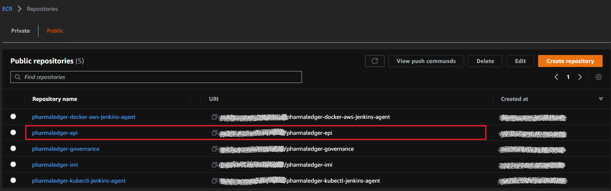
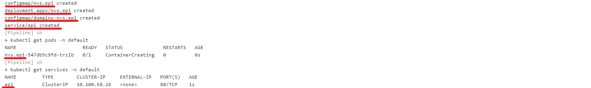

# Prerequisites

Have a working cluster and kubectl and aws cli v2.0 installed.<br>
For AWS CLI v2.0 installation see https://docs.aws.amazon.com/cli/latest/userguide/install-cliv2.html 


# Governance SSApp and Jenkins Server deployment

Clone the repository https://github.com/PharmaLedger-IMI/governance-workspace.git .<br>
```shell
git clone https://github.com/PharmaLedger-IMI/governance-workspace.git
cd governance-workspace
```
Configure the Amazon access in the file <i>./scripts/.env</i> <br>
Execute the deployment script.
```shell
./scripts/deploy-jenkins-gov.sh
```
Clean the configured Amazon access keys from the file <i>./scripts/.env</i> <br>
# Conventions

## Paths and file names

<li> Kubernetes deployment templates must be located under path /docker/k8s/templates</li>
<li> Docker file must be located under path /docker and named <i>Dockerfile</i></li>


## Amazon resources
The usecase docker image is published to the Amazon repository.<br/>
It is build using the convention <i> pharmaledger-maindomain </i>, where :
    <li> maindomain : the blockchain domain - main domain configuration (eg.epi, epiqa, etc.)  </li>
<br>
For example, if the maindomain is configured as <i>epi</i>, in Amazon there must a repository with the name  <i>pharmaledger-epi</i>.
 



## Kubernetes resources
For usecase deployment on kubernetes the following files are required:
<li>configmap.yaml.template which will produce the <i>subdomain</i> config map</li>
<li>domains-configmap.yaml.template which will produce the <i>domains-subdomain</i> config map</li>
<li>deployment.yaml.template which will produce the <i>subdomain</i> deployment </li>
<li>service.yaml.template which will produce the <i>maindomain</i> service</li>

For example, if it's started an installation using the following configuration:
<li>main domain: epi </li>
<li>sub domain : nvs.epi</li>

it will produce the following output:



<li>config maps <i>nvs.epi</i> and <i>domains-nvs.epi</i> are generated</li>
<li>deployment <i>nvs.epi</i> is generated which will produce pods like nvs.epi-<i>identifiers</i> </li>
<li>service <i>epi</i> is created</li>

## References
<li>maindomain : configuration of main domain entry in blockchain domain dialog</li>
<li>subdomain : configuration of sub domain entry in blockchain domain dialog</li>
